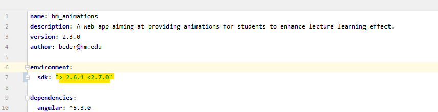
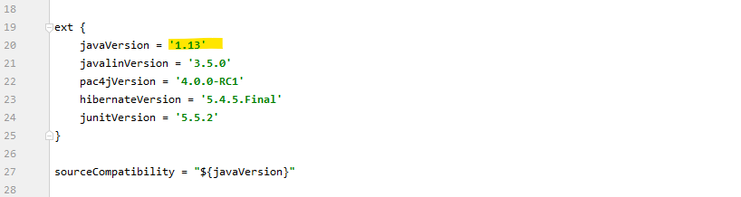
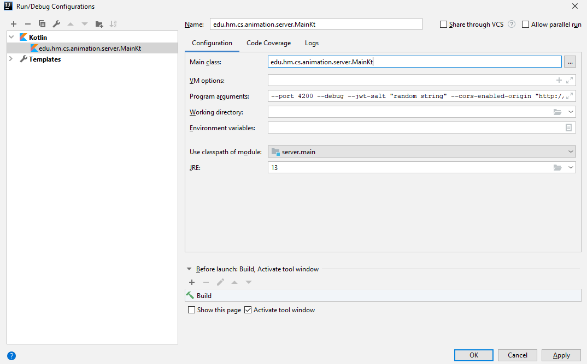

# Guide

This Guide will lead you through development with the Networks animation Web Application Server and Client.


## Content

1. [Introduction](#introduction)
1. [Installation](#installation)
    - [Prerequisites](#prerequisites)
    - [Database Setup](#database-setup)
    - [IntelliJ IDEA](#intellij-idea)
1. [Development](#development)
1. [Testing](#testing)
1. [Deployment](#deployment)
1. [Architecture](#architecture)


## Introduction

The application systems aims at providing animations for students to support lecture comprehensibility.
Previous to the application there were several Java applets. Unfortunately the Java applet technology suffered from severe security issues and are now deprecated in most modern browsers, thus not easy accessible.
To solve this issue this application has been created, which is served as web application using modern web technologies and therefore accessible using any browser.


## Installation

The following chapters will guide you through the installation of the development environment for the application system.


### Prerequisites

Make sure you have the **Dart SDK** installed (At the time of writing version `2.6.1`). 
If you haven't head over to https://dart.dev/get-dart and get it!
Since the version might have been changed by now, check the file `pubspec.yaml` in the root of the client repository.
That should look something like the following screenshot where I highlighted the version boundaries of the Dart SDK.
It should work just fine if you install a version **within** this boundaries.
However I recommend getting the oldest possible version listed (2.6.1).



> If you're not familar with Dart yet and want to develop the client, I'd recommend spending an hour or two on doing the [Dart language tour](https://dart.dev/guides/language/language-tour).

Next up check that you have **Git** (https://git-scm.com/) installed in order to clone the repositories containing the projects server and client (see [next headline](#cloning)).

For the Server you'll need a recent Java **JDK** version (at the time of writing its Java 13).
To make sure its the correct one head over to the `build.gradle` file in the Server repositorys root.
Should look something like this:



All other dependencies should be installed automatically by the Server build tool **Gradle** and the Client build tool **pub** when opening the projects in your favorite IDE.


### Database Setup

Since the Server requires a database to be set up we'll do just that.
Head over to https://www.postgresql.org/ and install the database server for your platform.

Once that is done create a database called `hmserver` and make sure the username is `postgres` and the password is `root`.
The server will use that one later on.

> You may wonder why the name of the database. 
> It is defined in the file at `animation-server/src/main/resources/META-INF/persistence.xml` which defines the JPA configuration. 
> A great extension of the server application would be a dynamic creation at runtime where you can specify the used database options for example by command line arguments.


### Cloning

First and foremost you'll need to clone the two parts of the application: Server and Client.
They reside in different repositories, so that it is easier to version them separately.

> The thought behind this is that you probably would want to add new animations and release them without needing to deploy the server again since it hasn't been touched at all.

At the time of writing the clone process would look something like this:

```
git clone https://HOST/animation-server.git
```

and 

```
git clone https://HOST/netzwerke-animationen.git
```

where `HOST` is the Git repository hostname. Although names might have changed by now as well.

Next step is to open the projects up in your favorite IDE!


### IntelliJ IDEA

> Since IntelliJ IDEA has support for pretty much every programming language and technology you could need during development it is a great pick on developing this application (Avoids having two different IDEs open).

If you haven't already please add the Dart plugin by going to `Settings > Plugins > Marketplace` and restart your IDE.
Once restarted you will have to add the installed Dart SDK to the plugin in the IntelliJ Settings dialog at `Settings > Languages & Frameworks > Dart`.

Using IntelliJ IDEA as IDE you can add the server and client modules into the same instance, so that you don't have to run two windows alongside each other.
Just open one of the two projects within the IDE (Server project by selecting the `build.gradle` file and the Client by just selecting the repository folder) and go to `File > New > Module from Existing Sources...`, select the other project and they will be shown in the project tree.


Once you have opened both projects the Server project will most likely configure the project and download dependencies using Gradle and the Client project will show some errors from the Dart Analysis tab.
Either open up the `pubspec.yaml` file and select the option on the top stating `Get dependencies` or open a terminal and run `pub get` to fetch all needed dependencies for the Client project.

Once that is done you are pretty much about to start developing!


## Development


### Start the Server

Before running the Client you'll have to start the Server.
Either create a Shell or Batch script to start up your Server or create an IntelliJ run configuration.



Add the following list of program arguments to the run configuration:

```
--port 4200
--debug
--jwt-salt "random string"
```

The port is self-explanatory. 
`--debug` means that it should enable functions used when developing, such as debug logging and CORS enabled for all origins.
The `--jwt-salt` argument is need for the authentication mechanism the app is using called JWT, which is short for JSON Web Tokens.

Start up the server and you should see a message like `[main] INFO io.javalin.Javalin - Javalin started in 490ms \o/` in the last line of the console.


### Start the Client

Starting the Client easier than starting the Server as it does not involve any command line arguments to be passed over.
I recommend you simply open up a terminal/console and run `pub run build_runner serve --live-reload` in the root of the Client repository.

After a while it should display a line stating that the development server is running at `localhost:8080`.
You can type that into Google Chrome (It needs to have Dart support in order to run in development mode) and the application client will be loaded.

Once you apply any changes to the clients source code the build runner will automatically recompile all needed files and reload the website.

#### Debugging

Once ready to develop you might miss debugging.
With IntelliJ you need to install the JetBrains Plugin within your browser.
Once that is done create a new JavaScript Debug launch configuration with is configured to use `localhost:8080` and fire it up.
Debugging should work as expected.

## Testing

Currently no unit tests are used, because this project was carried out as a small side project for university without much time on hand. 
The only test method used is the manual attempt to test everything (which works at the moment because the application is still quite small).

Feel free to add unit tests!


## Deployment

Since the projects are hosted on GitLab we use a GitLab runner to continuously build and deploy the application on `www.sam.cs.hm.edu`.
See the `.gitlab-ci.yml` files in both projects to see how that's done in detail.


### Server

The server is deployed as service on the host machine.


#### Building

Build the production artifact by calling `./gradlew -Dorg.gradle.java.home=/opt/jdk-12 shadowJar`.
After success the built artifact will be located at `{SERVER_PROJECT_ROOT}/build/libs/animation-server.jar`.


#### Service

To start the service call `sudo systemctl stop hm-animations-server.service`.

To start it call `sudo systemctl restart hm-animations-server.service`.

You can also see the logs of the running server by calling `journalctl -u hm-animations-server.service -b -e -f`.


#### Certificate renewal process

The servers REST API is served via HTTPS.
Thus it needs a valid certificate which we get from Let's encrypt.

The servers underlying framework Javalin uses Jetty as application server.
We register a file watcher which will listen on a keystore file (which contains the certificate and private key to use).
Once the keystore file is updated automatically once every few months the server will pick up and use the new certificate from the changed keystore.
Thus there is no downtime to the server even when running a long time.

But where does the certificate really come from?
We use an Apache HTTPD web server to serve the Client application from.
The Let's Encrypt `certbot` is already registered for the Apache web server and renews automatically.
Therefore we do not need to call the certbot ourselves but just use the certificate of the Apache web server for our application server.
The current certificate and private key are always stored at `/etc/letsencrypt/live/www.sam.cs.hm.edu`.

Using a renewal hook on the certbot we call a script called `convertkeystore.sh` at `/etc/letsencrypt/renewal-hooks/post` to convert a newly fetched certificate and private key from Let's Encrypt to a keystore format which is a usable format for Java.
It copies the generated keystore to `/opt/keystore/keystore.p12` on which the file watcher of the server application is listening to.


### Client

The client is deployed on the same machine as the server.


#### Building

Run `pub run build_runner build --release --output build` to execute a release build of the web application in the folder `build`.

> Note that you won't need Google Chrome (or another Dart-supporting browser) to run release builds of the web application since they are compiled to pure JavaScript.


#### Deployment Notes

The build output (in the build folder when doing a release build) is deployed on an Apache HTTPD web server on `www.sam.cs.hm.edu`.
You can find the deployed files and folders on the host machine at `/var/www/html/`.

The deployment process varies by branch.
A master branch build will be deployed directly under `/var/www/html` while another branch build for example `develop` will be deployed to `/var/www/html/develop`.
That way you can access all built branches over the Apache web server: `https:///www.sam.cs.hm.edu/develop`.

All previously and currently released versions of the client web application are also listed under `/var/www/html/version/index.html`.
You can access this page with `https://www.sam.cs.hm.edu/version`.
Note that this page is managed manually and will not update automatically.


## Architecture

To gain deeper understanding of the projects the following points will describe some aspects of the current architecture.


### Project structure

In order to find where stuff belongs to it's key to understand the project structure.


#### Client

Below you'll find a short description of the most important top-level directories and files.

```
    - docs -> This guide
    - lib -> Source folder of the client application (Dart)
        - src
            - router -> Logic regarding app routing
            - services -> Some services used all over the app (for example for translations)
            - ui -> All UI related things
                - animations -> HTML5 Canvas animation components are located here
                - canvas -> Generic logic and drawables used in the animations
                - view -> Other angular views (management views for example)
            - util -> Things generally useful for the application which does not really fall under a specify category
        - app_component.dart -> Main angular component
    - res -> Generally for resources which are not served (for example Adobe Illustrator project files for the application icons)
    - web -> Resource files for the web application + entry point of the application (index.html + main.dart)
    - .gitlab-ci.yml -> Gitlab build configuration
    - CHANGELOG.md -> Short notes about new stuff in releases
    - pubspec.lock -> Lock file for the pub package manager to ensure reproducible builds
    - pubspec.yaml -> Description of the project for the Dart package manager "pub" + Dependencies
    - README.md -> General information about the client project
```

During development of the Client you'll be working in the `lib` folder most of the time as it contains all the program logic.


#### Server

The Server is a Gradle project and thus has the normal directory structure.

```
    - src
        - main
            - kotlin
                - edu.hm.cs.animation.server
                    - animation -> Logic/Model regarding animations
                    - animgroup -> Logic/Model regarding animation groups
                    - security -> Authentication of the service
                    - user -> User model and services
                    - Main.kt -> Entry point of the application
            - resources
                - META-INF
                    - persistence.xml -> JPA configuration
    - .gitlab-ci.yml -> Gitlab build configuration
    - build.gradle -> Gradle build configuration + Dependencies
    - CHANGELOG.md -> Short notes about new features in releases
    - README.md -> General information about the server project
```

