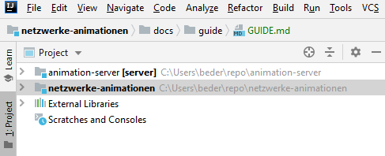

# Guide

This Guide will lead you through development with the Networks animation Web Application Server and Client.


## Content

1. [Introduction](#introduction)
1. [Installation](#installation)
    - [Prerequisites](#prerequisites)
    - [Database Setup](#database-setup)
    - [IntelliJ IDEA](#intellij-idea)
1. [Development](#development)
1. [Testing](#testing)
1. [Deployment](#deployment)
1. [Architecture](#architecture)


## Introduction


## Installation


### Prerequisites

Make sure you have the **Dart SDK** installed (At the time of writing version `2.6.1`). 
If you haven't head over to https://dart.dev/get-dart and get it!
Since the version might have been changed by now, check the file `pubspec.yaml` in the root of the client repository.
That should look something like the following screenshot where I highlighted the version boundaries of the Dart SDK.
It should work just fine if you install a version **within** this boundaries.


> If you're not familar with Dart yet and want to develop the client, I'd recommend spending an hour or two on doing the [Dart language tour](https://dart.dev/guides/language/language-tour).

Next up check that you have **Git** (https://git-scm.com/) installed in order to clone the repositories containing the projects server and client (see [next headline](#cloning)).

For the Server you'll need a recent Java **JDK** version (at the time of writing its Java 13).
To make sure its the correct one head over to the `build.gradle` file in the Server repositorys root.
Should look something like this:


All other dependencies should be installed automatically by the Server build tool **Gradle** and the Client build tool **pub** when opening the projects in your favorite IDE.


### Database Setup

Since the Server requires a database to be set up we'll do just that.
Head over to https://www.postgresql.org/ and install the database server for your platform.

Once that is done create a database called `hmserver` and make sure the username is `postgres` and the password is `root`.
The server will use that one later on.


### Cloning

First and foremost you'll need to clone the two parts of the application: Server and Client.
They reside in different repositories, so that it is easier to version them separately.

> The thought behind this is that you probably would want to add new animations and release them without needing to deploy the server again since it hasn't been touched at all.

At the time of writing the clone process would look something like this:

```
git clone https://HOST/animation-server.git
```

and 

```
git clone https://HOST/netzwerke-animationen.git
```

where `HOST` is the Git repository hostname. Although names might have changed by now as well.

Next step is to open the projects up in your favorite IDE!


### IntelliJ IDEA

> Since IntelliJ IDEA has support for pretty much every programming language and technology you could need during development it is a great pick on developing this application (Avoids having two different IDEs open).

If you haven't already please add the Dart plugin by going to `Settings > Plugins > Marketplace` and restart your IDE.
Once restarted you will have to add the installed Dart SDK to the plugin in the IntelliJ Settings dialog at `Settings > Languages & Frameworks > Dart`.

Using IntelliJ IDEA as IDE you can add the server and client modules into the same instance, so that you don't have to run two windows alongside each other.
Just open one of the two projects within the IDE (Server project by selecting the `build.gradle` file and the Client by just selecting the repository folder) and go to `File > New > Module from Existing Sources...`, select the other project and they will be shown in the project tree.



Once you have opened both projects the Server project will most likely configure the project and download dependencies using Gradle and the Client project will show some errors from the Dart Analysis tab.
Either open up the `pubspec.yaml` file and select the option on the top stating `Get dependencies` or open a terminal and run `pub get` to fetch all needed dependencies for the Client project.

Once that is done you are pretty much about to start developing!


## Development

### Start the Server

Before running the Client you'll have to start the Server.
Either create a Shell or Batch script to start up your Server or create an IntelliJ run configuration.


Add the following list of program arguments to the run configuration:

```
--port 4200
--debug
--jwt-salt "random string"
```

The port is self-explanatory. 
`--debug` means that it should enable functions used when developing, such as debug logging and CORS enabled for all origins.
The `--jwt-salt` argument is need for the authentication mechanism the app is using called JWT, which is short for JSON Web Tokens.

Start up the server and you should see a message like `[main] INFO io.javalin.Javalin - Javalin started in 490ms \o/` in the last line of the console.

### Start the Client

Starting the Client easier than starting the Server as it does not involve any command line arguments to be passed over.
I recommend you simply open up a terminal/console and run `pub run build_runner serve --live-reload` in the root of the Client repository.


## Testing

Currently no unit tests are used, because this project was carried out as a small side project for university without much time on hand. 
The only test method used is the manual attempt to test everything (which works at the moment because the application is still quite small).

Feel free to add unit tests!


## Deployment

## Architecture

### Project structure